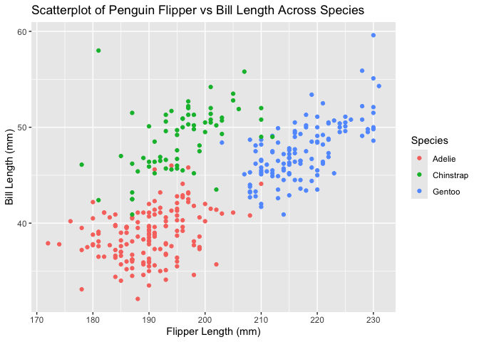

p8105_hw1_jsm2298
================
Jonathan Morris
2026-09-22

# Load Packages

``` r
library(tidyverse)
```

    ## ── Attaching core tidyverse packages ──────────────────────── tidyverse 2.0.0 ──
    ## ✔ dplyr     1.1.4     ✔ readr     2.1.5
    ## ✔ forcats   1.0.0     ✔ stringr   1.5.1
    ## ✔ ggplot2   3.5.2     ✔ tibble    3.3.0
    ## ✔ lubridate 1.9.4     ✔ tidyr     1.3.1
    ## ✔ purrr     1.2.0     
    ## ── Conflicts ────────────────────────────────────────── tidyverse_conflicts() ──
    ## ✖ dplyr::filter() masks stats::filter()
    ## ✖ dplyr::lag()    masks stats::lag()
    ## ℹ Use the conflicted package (<http://conflicted.r-lib.org/>) to force all conflicts to become errors

``` r
library(ggplot2)
library(palmerpenguins)
```

    ## 
    ## Attaching package: 'palmerpenguins'
    ## 
    ## The following objects are masked from 'package:datasets':
    ## 
    ##     penguins, penguins_raw

# Question 1:

## Load Data

``` r
data("penguins", package = "palmerpenguins")
```

## Penguins Data Description:

The penguins dataset includes size measurements of adult foraging
penguins near the Palmer research station in Antarctica. The data
contains variables such as the species of the penguin, which island they
were found and measured on, both bill and flipper length in mm, bill
depth, body mass, sex, and the year the data was collected. The data has
344 rows and 8 columns. The mean flipper length is 200.9152 millimeters.

## Penguin Data Scatterplot:

    ## Warning: Removed 2 rows containing missing values or values outside the scale range
    ## (`geom_point()`).

<!-- -->

    ## Saving 7 x 5 in image

    ## Warning: Removed 2 rows containing missing values or values outside the scale range
    ## (`geom_point()`).

# Question 2:

## Create Data Frame:

``` r
## First, set our seed for reproducibility:
set.seed(112)

## Now generate the data:
rand_df <- tibble(
  rand_num = rnorm(10),
  rand_logic = case_when(
    rand_num > 0 ~ TRUE,
    TRUE ~ FALSE
  ),
  rand_char = c('my', 'all', 'time', 'favorite', 'alliums', 'are', "the", "onion", "and", "scallion"),
  rand_fac = as.factor(rbinom(10, 2, 0.5))
)

pull(rand_df, rand_num)
```

    ##  [1] -0.3142317  2.4033751 -0.7182640 -1.7606110 -1.1252812 -0.7195406
    ##  [7]  1.3102240  0.4518985  0.1521774  0.6533708

## Attempt to take some means:

``` r
# Mean of random numeric vector:
m <- mean(pull(rand_df, rand_num))

paste0("The mean of our random sample is: ", m)
```

    ## [1] "The mean of our random sample is: 0.0333117336898153"

``` r
# Mean of random logical vector:
m <- mean(pull(rand_df, rand_logic))

paste0("The mean of our random logical vector is: ", m)
```

    ## [1] "The mean of our random logical vector is: 0.5"

``` r
# Mean of character vector:
m <- mean(pull(rand_df, rand_char))
```

    ## Warning in mean.default(pull(rand_df, rand_char)): argument is not numeric or
    ## logical: returning NA

``` r
paste0("The mean of our character vector is: ", m, ", meaning that we cannot take the mean of a character vector.")
```

    ## [1] "The mean of our character vector is: NA, meaning that we cannot take the mean of a character vector."

``` r
# Mean of character vector:
m <- mean(pull(rand_df, rand_fac))
```

    ## Warning in mean.default(pull(rand_df, rand_fac)): argument is not numeric or
    ## logical: returning NA

``` r
paste0("The mean of our factor vector is: ", m, ", meaning that we cannot take the mean of a factor vector.")
```

    ## [1] "The mean of our factor vector is: NA, meaning that we cannot take the mean of a factor vector."
